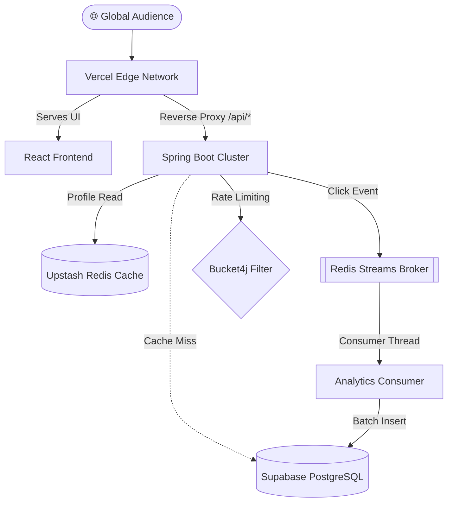

# 🔗 Linkly: Enterprise-Grade Creator Identity Platform


### 🌐 Live Environments
- **Production Application:** [linkly-plum.vercel.app](https://linkly-plum.vercel.app)
- **Interactive API Docs (Swagger):** [linkly-amwf.onrender.com/swagger-ui/index.html](https://linkly-amwf.onrender.com/swagger-ui/index.html)

---

## 📌 The Problem
Creators and influencers need a single "link-in-bio" to aggregate their digital identity. However, when a creator goes viral on TikTok or Instagram, their profile receives an unpredictable, massive surge of traffic. Standard CRUD applications buckle under this pressure—suffering from database connection pool exhaustion and table locking when trying to record analytics for every single click. 

**Linkly solves this.** It is explicitly designed to handle viral traffic spikes by decoupling heavy analytics writes from the critical read-paths using an event-driven message broker, ensuring the creator's page never goes down.

## 🏗️ How the System Works (Architecture)



## 🔥 Enterprise Engineering Highlights

### 1. Event-Driven Analytics via Redis Streams
To prevent database locking during viral traffic spikes, the analytics engine uses a highly optimized **Producer/Consumer pattern**. Link clicks are instantly packaged into `ClickEvents` and published to a **Redis Stream** in sub-millisecond time. A background `StreamListener` asynchronously consumes these events, performs heavy IP-geolocation lookups, and batch-inserts them into PostgreSQL.

### 2. Sub-Millisecond Read Latency (Redis Caching)
Creator profile endpoints heavily utilize Spring's `@Cacheable` and event-driven `@CacheEvict` invalidation, ensuring that 99% of viral traffic hits serverless Upstash RAM instead of bottlenecking the PostgreSQL database.

### 3. Bulletproof Security & DDoS Protection
Authentication is stateless and powered by JSON Web Tokens (JWT) transported via strictly configured `HttpOnly`, `SameSite=Lax` cookies to prevent XSS. Furthermore, the API employs **Bucket4j** for dynamic IP-based Rate Limiting to stop brute-force attacks and protect short-link resolution from DDoS spam.

### 4. Zero-Downtime Database Migrations (Flyway)
The persistence layer is managed entirely by **Flyway Database Migrations** (`V1__init_schema.sql`). Instead of relying on unsafe ORM auto-generation (`ddl-auto`), every database change is version-controlled, ensuring deterministic schema evolution.

### 5. Automated Testing & Observability
The core business logic is fortified by **JUnit 5 and Mockito** unit tests. The API conforms to strict REST standards and is self-documenting via **Swagger / OpenAPI 3.0**. **Spring Boot Actuator** exposes live `/actuator/health` metrics for system monitoring.

---

## 📊 Performance & Load Strategy
While deployed on a serverless free-tier container (512MB RAM, 0.1 CPU), the architecture is engineered to punch above its weight:
- **Rate Limiting:** Bucket4j intercepts and drops malicious requests in `<1ms`.
- **Read Throughput:** Viral profiles are served directly from Redis in `<10ms` without touching PostgreSQL.
- **Write Throughput:** Click analytics are pushed to Redis Streams in `<2ms`. The background thread processes them at a controlled rate, preventing DB connection exhaustion regardless of frontend load.

## ⚖️ Trade-offs & Architecture Decisions
- **Eventual Consistency in Analytics:** By using Redis Streams, click counts do not update instantly on the dashboard. There is a slight delay (eventual consistency). This trade-off is absolutely necessary to guarantee the public page remains fast under viral load.
- **Stateless Authentication:** We chose JWTs over stateful sessions to allow the Spring Boot backend to scale horizontally without sticky sessions. The trade-off is that revoking a JWT immediately is difficult without building a token blacklist.

## 🚧 Honest Limitations
- **Serverless Cold Starts:** Because this is hosted on a free-tier Render cluster, the JVM goes to sleep after 15 minutes of inactivity. The first visitor may experience a **~40-second cold start delay**. Once warm, latency drops back to milliseconds.
- **No Distributed Tracing:** While we have Actuator for metrics, we currently lack distributed tracing (e.g., Jaeger/Zipkin) to trace requests across microservices.

---

## 🚀 Quick Start (Local Development)

### Setup
1. **Clone the repository:**
   ```bash
   git clone https://github.com/yourusername/linkly.git
   cd linkly
   ```

2. **Configure the Environment:**
   Update `src/main/resources/application.properties` with your PostgreSQL and Redis credentials.

3. **Boot the Cluster:**
   Linkly includes a custom orchestrator script to concurrently boot both the Spring Boot server and the Vite edge server.
   ```bash
   chmod +x run.sh
   ./run.sh
   ```
