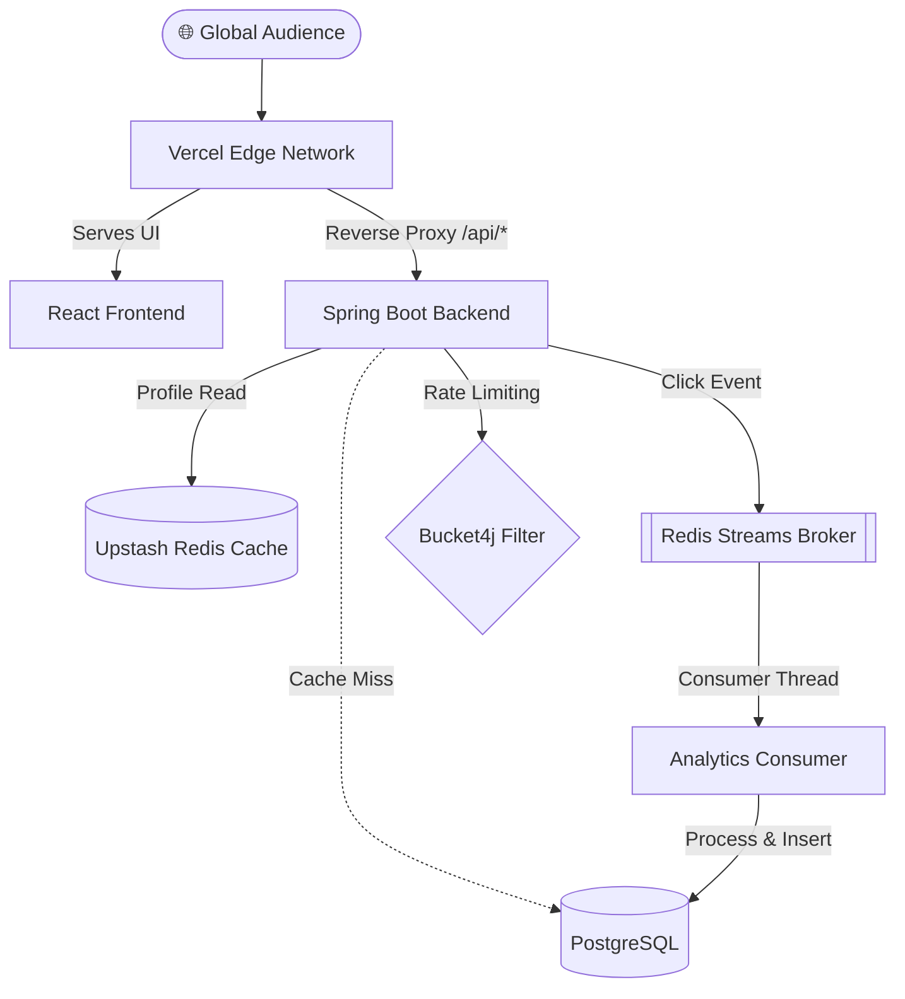

# 🔗 Linkly: Creator Identity & Analytics Platform


### 🌐 Live Environments
- **Production Application:** [linkly-plum.vercel.app](https://linkly-plum.vercel.app)
- **Interactive API Docs (Swagger):** [linkly-amwf.onrender.com/swagger-ui/index.html](https://linkly-amwf.onrender.com/swagger-ui/index.html)

---

## 📌 The Problem
Creators and influencers need a single "link-in-bio" to aggregate their digital identity. However, when a creator goes viral, their profile can receive an unpredictable surge of traffic. Standard CRUD applications buckle under this pressure—suffering from database connection pool exhaustion and table locking when trying to record analytics for every single click. 

**Linkly solves this.** It is explicitly designed to handle traffic spikes by decoupling heavy analytics writes from the critical read-paths using an event-driven message broker, ensuring the creator's page remains fast and responsive.

## 🏗️ How the System Works (Architecture)


```mermaid
graph TD
    User([🌐 Global Audience]) --> Vercel[Vercel Edge Network]
    Vercel -->|Serves UI| React[React Frontend]
    Vercel -->|Reverse Proxy /api/*| Spring[Spring Boot Backend]
    
    %% Read Path
    Spring -->|Profile Read| Cache[(Upstash Redis Cache)]
    Spring -.->|Cache Miss| PG[(PostgreSQL)]
    
    %% Write Path (Analytics)
    Spring -->|Click Event| RedisStream[[Redis Streams Broker]]
    RedisStream -->|Consumer Thread| AnalyticsService[Analytics Consumer]
    AnalyticsService -->|Process & Insert| PG
    
    %% Security
    Spring -->|Rate Limiting| Bucket4j{Bucket4j Filter}
```

## 🔥 Engineering Highlights

### 1. Event-Driven Analytics via Redis Streams
To prevent database locking during traffic spikes, the analytics engine uses a **Producer/Consumer pattern**. Link clicks are instantly packaged into `ClickEvents` and published to a **Redis Stream**. A background `StreamListener` asynchronously consumes these events, performs IP-geolocation lookups via an external API (with in-memory caching to avoid rate-limits), and inserts them into PostgreSQL. 

### 2. High-Availability Cache Fallbacks
Creator profile endpoints and URL resolution utilize Spring's `@Cacheable` and explicit Redis commands to serve reads from serverless Upstash RAM. Crucially, the application implements robust **circuit-breaker-like `try-catch` fallbacks**: if the Redis cluster becomes unavailable or rate-limited, the application seamlessly fails over to PostgreSQL, ensuring true high-availability.

### 3. Cross-Origin Security & Rate Limiting
Authentication is stateless and powered by JSON Web Tokens (JWT). Due to modern browser restrictions on third-party cross-origin cookies (ITP/Incognito), the platform secures APIs using HTTP `Authorization: Bearer` headers. Furthermore, the API employs **Bucket4j** for dynamic IP-based rate limiting (using `ConcurrentHashMap`) to prevent brute-force attacks and mitigate spam.

### 4. Background Keep-Alive Mechanism
To combat cold starts in the serverless environment, the system utilizes a background `@Scheduled` cron job that pings the application's health endpoint, configurable directly from the Admin Dashboard, keeping the JVM warm and responsive.

### 5. Automated Testing & Observability
The core business logic is tested using **JUnit 5 and Mockito**. The API conforms to REST standards and is self-documenting via **Swagger / OpenAPI 3.0**. **Spring Boot Actuator** exposes live `/actuator/health` metrics for system monitoring.

---

## ⚖️ Trade-offs & Architecture Decisions
- **Eventual Consistency in Analytics:** By using Redis Streams, click counts do not update instantly on the dashboard. There is a slight delay (eventual consistency). This trade-off ensures the public redirection page remains fast under load.
- **In-Memory Rate Limiting:** Rate limiting is currently handled in JVM memory using `ConcurrentHashMap` rather than Redis. While this saves Redis bandwidth and prevents exhausting free-tier quotas, it means rate limits are not shared across multiple nodes if the application scales horizontally.
- **Stateless Authentication:** We chose JWTs over stateful sessions to allow the Spring Boot backend to scale horizontally without sticky sessions.

---

## 🚀 Quick Start (Local Development)

### Setup
1. **Clone the repository:**
   ```bash
   git clone https://github.com/yourusername/linkly.git
   cd linkly
   ```

2. **Configure the Environment:**
   Update `src/main/resources/application.properties` with your PostgreSQL and Redis credentials.
   Required Variables:
   - `DB_URL`, `DB_USERNAME`, `DB_PASSWORD`
   - `REDIS_URL`
   - `JWT_SECRET` (Must be at least 256 bits / 32 characters)
   - `FRONTEND_URL` (For CORS)
   - `ADMIN_PASSWORD` (For seeding the default admin account)

3. **Boot the Backend:**
   ```bash
   mvn spring-boot:run
   ```

4. **Boot the Frontend:**
   ```bash
   cd frontend
   npm install
   npm run dev
   ```
